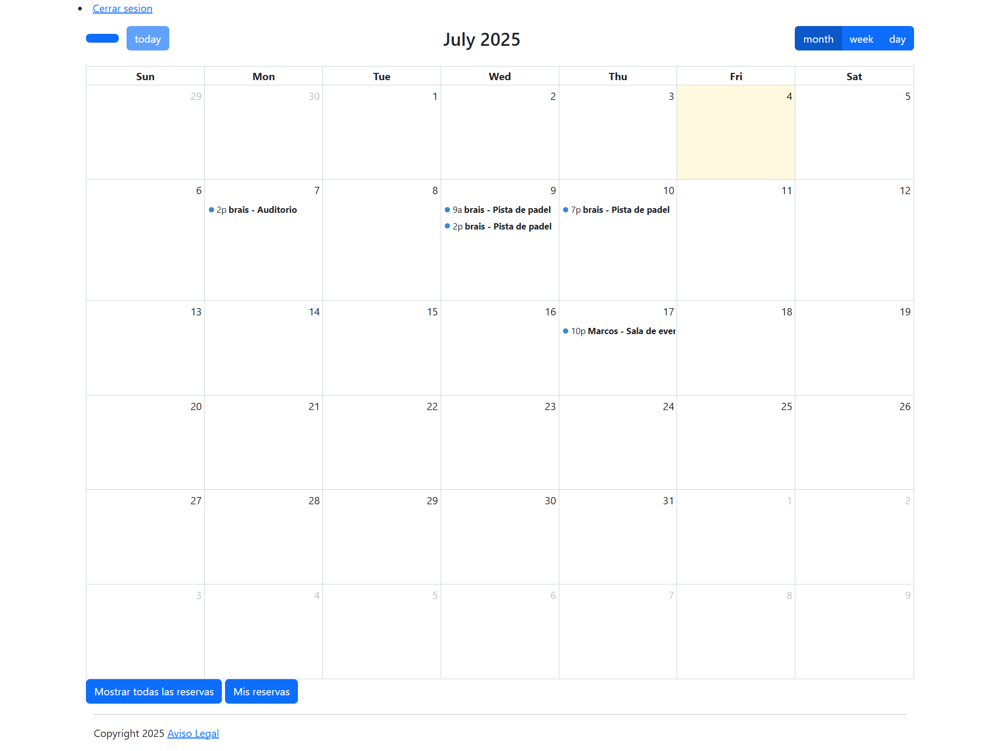

# Gestor de Reservas
Este proyecto tiene como objetivo reservar recursos como pistas deportivas o salas.

## Tabla de contenido
- [Descripción general](#descripcion-general)
  - [Captura de pantalla](#captura-de-pantalla)
  - [Links](#links)
- [Mi proceso](#mi-proceso)
  - [Llevado a cabo con](#llevado-a-cabo-con)
  - [Lo que aprendí](#lo-que-aprendi)
  - [Desarrollo continuo](#desarrollo-continuo)
- [Autor](#autor)

## Descripción general

### Captura de pantalla

### Links
- [Repositorio Git](https://github.com/braismarquez2025/Gestor_de_reservas)
- [URL del sitio en vivo]()

## Mi proceso

### Llevado a cabo con
- Django
- Bootstrap

### Lo que aprendí
Este ha sido mi primer proyecto utilizando django que he realizado por mi cuenta y me ha servido muchísimo para entender y manejar mejor las utilidades de este, la creación de vistas, la organización de urls o la creación de modelos. Además, el proyecto también incluye la parte de admin.

### Desarrollo continuo
Mi objetivo es realizar más proyectos como este para seguir practicando y coger más y más soltura a la hora de hacer las cosas, ya que en este proyecto por ejemplo he tardado bastante tiempo en insertar el calendario y configurarlo para que funcionase correctamente. Corrigiendo ciertos aspectos conseguiré avanzar mucho más rápido y trabajar de manera más eficaz y sencilla, sin tantas complicaciones.

### Autor 
- Usuario de Frontend - [@braismarquez2025](https://www.frontendmentor.io/profile/braismarquez2025)
- Gmail - braismarquez2003@gmail.com
- GitHub - https://github.com/braismarquez2025

